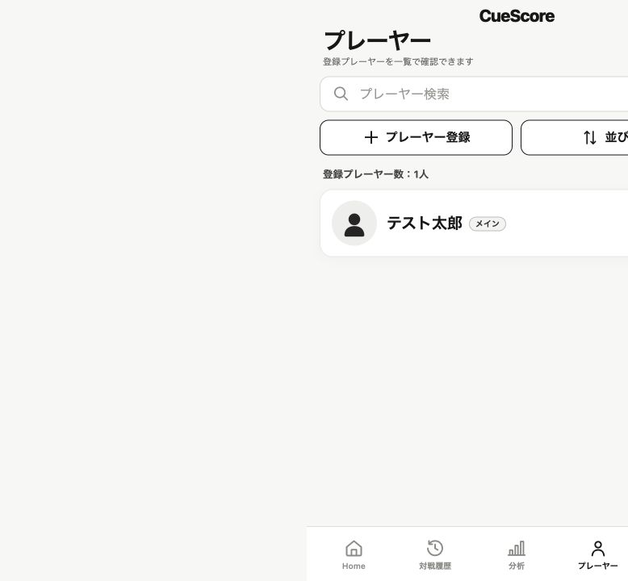
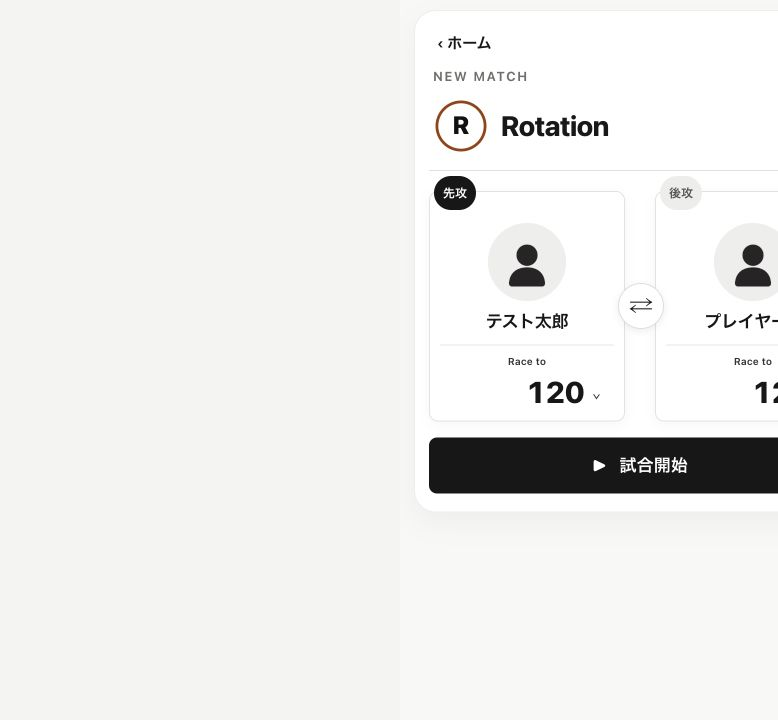

# CueScore Primary Player v1.0 実装報告

実装基準: `CueScore_Primary_Player_Codex_Implementation_Instructions_v1.0.docx`

## 調査した既存構造

- PlayerはLocalStorageの`rotationScoreboard.players.v1`に配列保存される。
- Playerの既存`id`は試合履歴の`registeredPlayerId`で参照される。
- ローカルバックアップとSupabase同期はPlayer配列を含む既存ペイロードを使用する。
- Player登録・編集、一覧、Match Setupは全競技共通のPlayer機能として実装されている。

## 採用したデータ保持方式

- Playerレコードの任意フィールド`isPrimary: true`を単一ソースとした。
- `false`は保存せず、既存レコードにはフィールド追加を強制しない。
- 読込・保存の共通正規化処理で、`isPrimary: true`は最大1件に収束させる。
- Player IDは既存の不変`id`を維持し、編集画面で確認できるようにした。
- Player配列に含まれるため、既存のバックアップ・Supabase同期経路でもPlayer IDとメイン情報が一緒に保持される。

## 実装内容

- 登録・編集画面に「メインプレーヤーに設定」を追加。
- 最初のPlayer登録時は初期状態をONに設定。
- 別PlayerをONにして保存すると、以前のメインを自動解除。
- 現在のメインをOFFにして「メインなし」にできる。
- Player一覧でメインを常に先頭に配置し、文字ラベル「メイン」を表示。
- 新規Match Setupの初回初期化時に限り、Player 1へ有効なメインを設定。
- Player 2は未選択のまま維持。
- 手動選択、再戦、復元済みの選択がある場合は自動設定で上書きしない。
- メインPlayer削除時はPlayerレコードの削除だけで安全に「メインなし」へ移行。
- Service Workerのバージョンを更新し、オフライン利用時にも新版へ切り替わるようにした。

## 変更ファイル

- `index.html`
- `sw.js`
- `docs/assets/adopted-ui/primary-player-list-v1.png`
- `docs/assets/adopted-ui/primary-match-setup-v1.png`
- 本報告書

## 後方互換と将来拡張

- 既存Player IDは変更・再発行しない。
- 既存Player、履歴、分析、アバター、競技設定を初期化しない。
- メイン情報を持たない既存Playerは従来どおり読込可能。
- 複数メインを含む競合データは、配列順で最初の有効Playerだけを採用する。
- 将来の共有ファイル方式では、Player IDを本人判定に利用できる構造を維持する。
- 共有ファイルの生成・送信・受信・取り込みは今回の対象外。

## テスト結果

- HTML内JavaScript構文検査: 成功
- Service Worker構文検査: 成功
- `git diff --check`: 成功
- 初回Player登録時のメイン自動ON: 成功
- 別Playerをメインにした際の旧メイン解除: 成功
- メインの一覧最上部固定と文字ラベル: 成功
- 新規Match SetupでPlayer 1へ自動設定: 成功
- Player 2が未選択: 成功
- メイン変更後も既存Match SetupのPlayer 1を上書きしない: 成功
- 再読み込み後に新しいメインをPlayer 1へ設定: 成功
- 編集画面でPlayer IDを表示: 成功
- メインOFF後の「メインなし」: 成功
- ブラウザコンソールエラー: 0件

## 主要画面

## 未確認事項・既知の課題

- 実際の複数端末間でのSupabase競合試験は未実施。既存同期ペイロードと共通正規化処理への包含を確認した。
- 共有ファイル機能は仕様どおり未実装。

## Product Owner実機確認手順

1. Playerを1名登録し、「メイン」が表示されることを確認する。
2. 2人目を登録し「メインプレーヤーに設定」をONにする。
3. 一覧の最上部が2人目となり、1人目の「メイン」が解除されることを確認する。
4. 新しいMatch Setupを開き、Player 1がメイン、Player 2が未選択であることを確認する。
5. Player 1を別Playerへ変更し、画面再描画で勝手に戻らないことを確認する。
6. メインPlayerの編集画面で設定をOFFにし、「メインなし」を確認する。
7. アプリを再起動し、Player、履歴、アバター、各競技が従来どおり利用できることを確認する。
